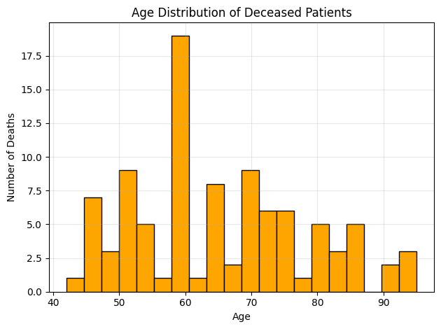
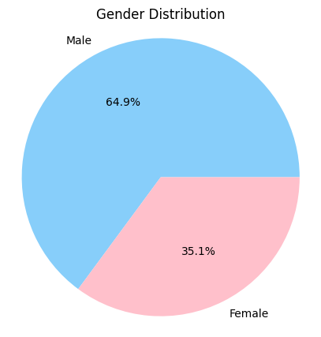

# Heart Failure Clinical Records Analysis

## Overview

Analysis of 299 heart failure patient records to identify mortality risk factors using exploratory data analysis and chi-square statistical testing.

---

## Key Insights

### Strong Mortality Predictors
- **Serum Creatinine (Kidney Function):** 55% higher in deceased patients (1.84 vs 1.18 mEq/L)
- **Serum Sodium (Electrolytes):** 4-5 mEq/L lower in deceased patients (135.4 vs 137.2)
- **Age:** 6.4 years older on average (65.2 vs 58.8 years)

### Non-Significant Factors
- **Gender:** No difference (p=1.0) - Male 32.0%, Female 32.4% death rate
- **High Blood Pressure:** No significant association (p=0.214)
- **Smoking:** No significant association (p=0.932)

### Disease Progression
- **Deceased patients:** 70.9 days mean follow-up, 45 days median (rapid deterioration)
- **Survivors:** 158.3 days mean follow-up, 180 days median (stable)
- **Ratio:** 4× longer follow-up period for survivors

---

## Analysis Visualizations

### Age Distribution

Deceased patients cluster around 60-65 years. Mean age: 65.2 years (range: 42-95)

Survivors show broader age distribution. Mean age: 58.8 years (range: 40-90)

### Gender Composition

Male: 64.9% | Female: 35.1% - Equal mortality rates across both groups

No statistically significant difference in death rates between genders (p=1.0)

### Clinical Biomarkers

Clear separation: Deceased patients show elevated kidney markers (median ~1.9) vs survivors (~1.1)

Low sodium indicates poor cardiac function: Deceased median ~134-135 vs survivors ~138-140

### Follow-up Time Comparison

Dramatic difference: Deceased patients experience rapid deterioration (45 days median) vs survivors' stable course (180 days median)

---

## Statistical Methods

- **Chi-Square Test of Independence** - Used for categorical variables (Gender, HBP, Smoking)
- **Descriptive Statistics** - Mean, median, standard deviation by outcome
- **Significance Level:** α = 0.05

**Test Results:**
| Factor | p-value | Significant? |
|--------|---------|--------------|
| Gender | 1.000 | No |
| High Blood Pressure | 0.214 | No |
| Smoking | 0.932 | No |

---

## Clinical Implications

**Priority Actions:**
1. Monitor serum creatinine in all patients - Elevated levels indicate poor prognosis
2. Assess electrolyte balance (serum sodium) - Low levels suggest disease severity
3. Enhanced surveillance for patients 60+ years old
4. Focus on biomarkers rather than traditional risk factors alone

---

## Conclusion

Kidney function and electrolyte balance emerge as the strongest mortality predictors in heart failure patients, while traditional risk factors (smoking, hypertension) show no significant association in this cohort. The 4× difference in disease progression timelines suggests two distinct patient phenotypes requiring different management strategies.